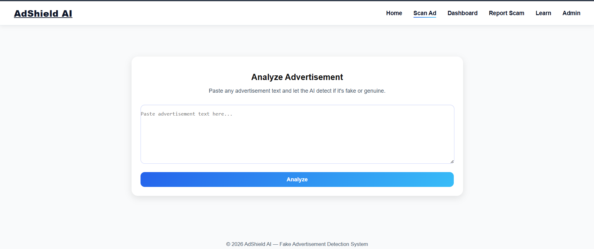
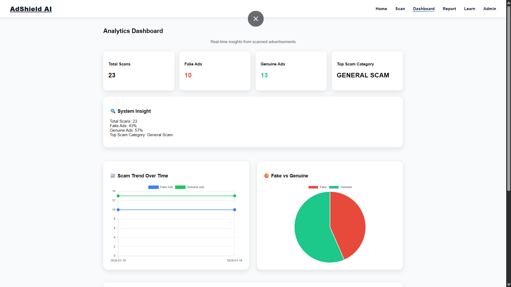
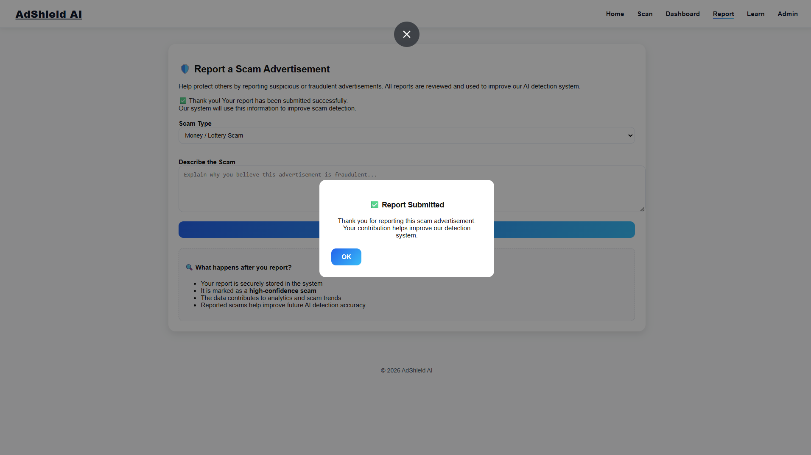
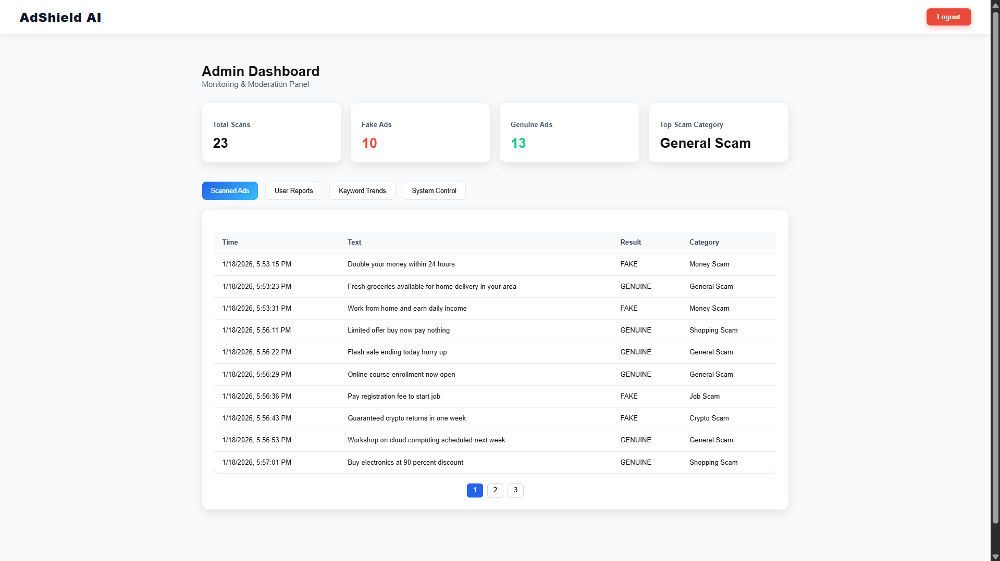
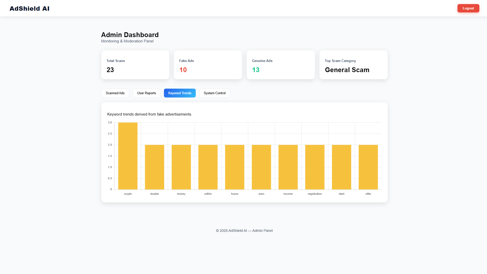

🛡️ AdShield AI

Fake & Fraudulent Advertisement Detection System

AdShield AI is an AI-powered web application designed to detect fake, scam, and fraudulent advertisements using Machine Learning and Natural Language Processing (NLP).
It helps users identify job scams, money scams, lottery frauds, crypto scams, and misleading promotions in real time.

The system provides:

Risk classification (Fake / Genuine)

Confidence score

Scam category detection

Admin moderation & analytics dashboard

---

🚀 Project Overview

With the rapid growth of online advertisements, scams have become increasingly common.
AdShield AI addresses this problem by analyzing advertisement text using a trained ML model combined with rule-based intelligence, ensuring higher accuracy and reliability.

This project is suitable for:

MCA / BCA Final Year Projects

AI / ML Demonstrations

Cybersecurity & Fraud Detection Use Cases

---

🧠 Technology Stack

🔹 Frontend

HTML5

CSS3

JavaScript (Vanilla JS)

Chart.js (for analytics & graphs)

AOS (Animate On Scroll)

🔹 Backend

Python

Flask

Flask-CORS

🔹 Machine Learning

Scikit-learn

TF-IDF Vectorizer

Logistic Regression (Binary Classification)

🔹 Storage

JSON files (scans.json, reports.json)

CSV dataset (dataset.csv)

---

✨ Key Features

🔍 1. Fake Advertisement Detection

Detects whether an advertisement is FAKE or GENUINE

Displays a confidence percentage

Highlights suspicious keywords

Uses both ML prediction + rule-based validation

📸 Screenshot: 

---

📊 2. Interactive Dashboard

Total number of scanned ads

Fake vs Genuine count

Top scam category

Category-wise bar chart

Fake/Genuine timeline graph

Pie chart visualization

📸 Screenshot: 

---

🗂️ 3. Scam Category Detection

Automatically classifies ads into:

💰 Money Scam

💼 Job Scam

🛍️ Shopping Scam

₿ Crypto Scam

🧾 General Scam

---

🚨 4. Report Scam (User Module)

Users can report suspicious ads manually

Reports are stored for admin review

Helps improve system intelligence

📸 Screenshot: 

---

🧑‍💼 5. Admin Panel

Secure admin login

View all scanned advertisements

Review and approve/reject user reports

Clear dashboard data

Keyword trend analysis from fake ads

📸 Screenshot: 

---

📈 6. Keyword Trend Analysis

Extracts most common keywords from verified fake ads

Helps identify emerging scam patterns

Useful for cybersecurity analysis

📸 Screenshot: 

---

📂 Project Folder Structure

AdShield/
│
├── backend/
│   ├── app.py                 # Flask backend
│   ├── train_model.py         # ML training script
│   ├── dataset.csv            # Training dataset
│   ├── model.pkl              # Trained ML model
│   ├── vectorizer.pkl         # TF-IDF vectorizer
│   ├── scans.json             # Stored scan results
│   ├── reports.json           # User reports
│
├── frontend/
│   ├── index.html             # Home page
│   ├── scan.html              # Scan advertisement
│   ├── dashboard.html         # User dashboard
│   ├── report.html            # Report scam
│   ├── admin.html             # Admin login
│   ├── admin-dashboard.html   # Admin panel
│   ├── learn.html             # Awareness page
│   ├── assets/
│   │   ├── css/style.css
│   │   └── js/script.js
│
├── requirements.txt
├── README.md
└── .gitignore

---

⚙️ Installation & Setup Guide

🔹 1. Clone the Repository

git clone [AdShield](https://github.com/Subroto17/AdShield.git)
cd AdShield

---

🔹 2. Create Virtual Environment

Windows

python -m venv venv

macOS / Linux

python3 -m venv venv

---

🔹 3. Activate Virtual Environment

Windows (PowerShell)

venv\Scripts\Activate.ps1

If blocked:

Set-ExecutionPolicy -Scope Process -ExecutionPolicy Bypass

Windows (CMD)

venv\Scripts\activate

macOS / Linux

source venv/bin/activate

---

🔹 4. Install Dependencies

pip install -r requirements.txt

---

🔹 5. Train the Machine Learning Model

cd backend
python train_model.py

This will generate:

model.pkl

vectorizer.pkl

---

🔹 6. Start Backend Server

python app.py

Backend runs at:

http://127.0.0.1:5000

---

🔹 7. Run Frontend

Open any frontend page using:

VS Code Live Server OR

Double-click frontend/index.html

---

🔐 Admin Credentials (Demo)

Username: ShouryaRaj
Password: Subroto@123

> ⚠️ For production, move credentials to environment variables.

---

🧪 How Prediction Works (Simplified)

1. User submits advertisement text

2. Text is cleaned & vectorized (TF-IDF)

3. ML model predicts fake/genuine

4. Rule-based checks verify red flags

5. Probability is calibrated

6. Result is saved to database

7. Dashboard updates in real time

---

🔮 Future Enhancements

Deep Learning (LSTM / BERT)

URL phishing detection

Image-based scam detection (OCR)

Cloud deployment (AWS / GCP)

User authentication

Continuous model retraining

---

📜 Disclaimer

This project is developed for educational and research purposes only.
Predictions are probabilistic and should not be treated as legal advice.

---

👨‍💻 Author

AdShield AI 
Developed by Subroto 

